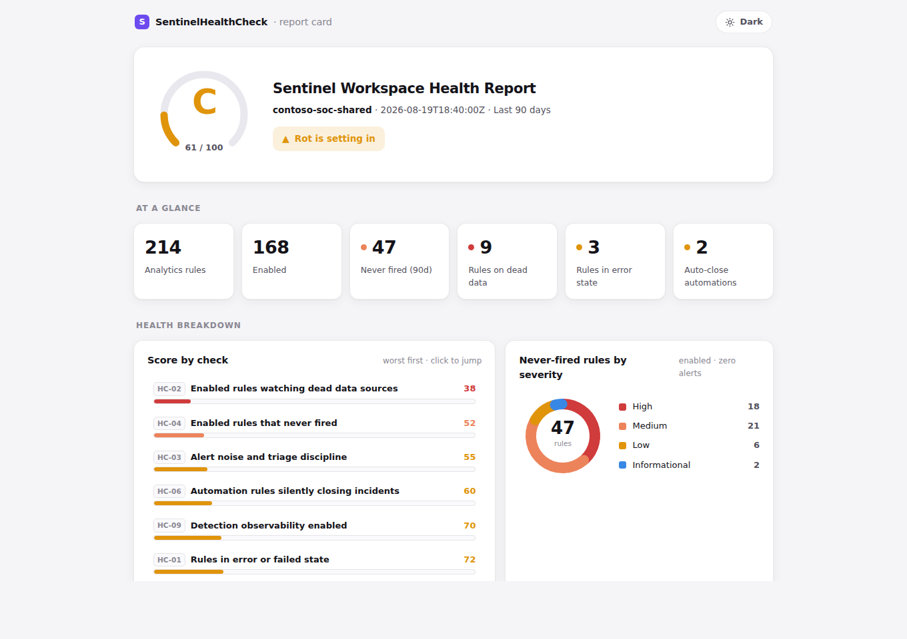

# SentinelHealthCheck

[](https://github.com/purpleshellsecurity/SentinelHealthCheck/actions/workflows/ci.yml)
[](https://github.com/PowerShell/PowerShell)
[](LICENSE)

**Grade your Microsoft Sentinel workspace in under five minutes and get an HTML
report card back.** One read-only PowerShell command. It runs on your machine,
it never writes to Sentinel, and nothing leaves your tenant.



<sub>A sample report card. The numbers are illustrative; the layout is exactly what the tool produces.</sub>

## Rule count is not coverage

Every workspace can tell you how many analytics rules it has. None of them tell
you how many are alive.

Vendor packs enabled during onboarding. Migration leftovers nobody owns. Rules
disabled during a noise storm two years ago. Rules watching a table that quietly
stopped ingesting in March.

The worst of those is the last one. **A rule that is enabled, error free, and
watching a dead table shows green.** The coverage report counts it. The
detection has been gone for months, because detections do not fail loudly —
their data does, quietly.

This tool finds the difference between the number you report upward and the
number that would actually catch someone.

## What it checks

| Check | Question it answers |
|-------|---------------------|
| **HC-09** Detection observability | Can the workspace even see its own detections (health, audit and query logging on)? Runs first |
| **HC-01** Rules in error state | Which rules are failing to run at all, and would you know? |
| **HC-02** Dead data sources | Which enabled rules watch tables that stopped ingesting — blind spots wearing green checkmarks? |
| **HC-03** Alert noise and triage discipline | Which rules have the worst false-alarm rates, and does every closed incident get classified? |
| **HC-04** Never-fired rules | Which enabled rules produced zero alerts in 90 days — tripwire or corpse? |
| **HC-05** Disabled inventory | How much claimed coverage is switched off? |
| **HC-06** Silent auto-close | Which automation rules close incidents before a human ever sees them? |
| **HC-08** Health signal coverage | Which resource types actually report health, and what values do they use? Informational, never graded |

## Quick start

You need PowerShell 7, the `Az.Accounts` module, and **Microsoft Sentinel
Reader + Log Analytics Reader** on the workspace. Nothing else.

```powershell
# 1. Install prerequisites (once)
winget install --id Microsoft.PowerShell --source winget
Install-Module Az.Accounts -Scope CurrentUser

# 2. Get the module
git clone https://github.com/purpleshellsecurity/SentinelHealthCheck.git
cd SentinelHealthCheck
Import-Module ./SentinelHealthCheck.psd1

# 3. Sign in and scan
Connect-AzAccount
Invoke-SentinelHealthCheck -SubscriptionId '<sub-id>' `
                           -ResourceGroupName '<rg>' `
                           -WorkspaceName '<workspace>'
```

The report lands next to you as `SentinelHealthCheck-<workspace>-<timestamp>.html`.
Open it, read your grade, send it to whoever asks how your coverage is doing.

> [!TIP]
> Scanning more than one workspace? Pipe them in and get one report each:
> ```powershell
> Get-AzOperationalInsightsWorkspace -ResourceGroupName '<rg>' | Invoke-SentinelHealthCheck -SubscriptionId '<sub-id>'
> ```

## What it touches, and what it doesn't

Running a stranger's script against your SIEM deserves a straight answer, so
here it is before you decide.

| | |
|---|---|
| **Permissions** | Microsoft Sentinel Reader and Log Analytics Reader. Nothing that can write, disable or delete |
| **What it does** | Four ARM collections and roughly a dozen KQL queries, all read-only |
| **What it changes** | Nothing. No rule, no setting, no incident, no data |
| **Where it runs** | Your machine, against your workspace, under your own Azure sign-in |
| **Where the data goes** | Nowhere. The report is a local HTML file. No telemetry, no phone-home, no account to create |
| **Reading it first** | Encouraged. Every check is its own file in [`Private/Checks/`](Private/Checks), and each one carries the KQL it runs |

## What's in the report

| Section | What it tells you |
|---------|-------------------|
| **A–F grade** | One weighted score for the whole detection estate |
| **KPI tiles** | Rule counts, never-fired, dead-data, erroring, auto-close at a glance |
| **Volume outliers** | Top-10 **noisiest** rules (most incidents, with FP rate) and top-10 **quietest** (fewest alerts, one dry spell from never-fired) |
| **Needs attention** | Each failing check with its findings table |
| **Passing / Not measured** | Collapsed, so the problems stay above the fold |

## Parameters

| Parameter | Default | Purpose |
|-----------|---------|---------|
| `-LookbackDays` | 90 | History window ending now. Presets tab-complete (7 / 14 / 30 / 60 / 90); any 7–365 accepted |
| `-StartDate` / `-EndDate` | (none) | Custom scan window instead of a lookback (max 365 days, `-EndDate` defaults to now). A date-only end means *through* that day |
| `-OutputPath` | `./SentinelHealthCheck-<ws>-<stamp>.html` | Report location |
| `-PassThru` | off | Return the full result object (every finding, uncapped) for automation |

> [!NOTE]
> With a custom range, point-in-time checks (rules in error, dead tables) are
> measured as of the window's end: the report shows what was broken *then*, not now.

## Status

> [!IMPORTANT]
> **Beta (0.4.0-beta).** Pre-release and looking for testers. It is read-only
> and safe to run, but expect rough edges — if something breaks or a finding
> looks wrong, please [open an issue](https://github.com/purpleshellsecurity/SentinelHealthCheck/issues).
> A report that says something surprising about your workspace is exactly the
> kind of issue worth filing.

## Contributing

Issues and PRs welcome. See [CONTRIBUTING.md](CONTRIBUTING.md) for the dev setup
and the rules that are not style preferences.

Built by [Purple Shell Security](https://www.purpleshellsecurity.com), a
detection engineering practice for teams running Microsoft Sentinel.

## License

[MIT](LICENSE).

> [!WARNING]
> Provided as-is. Run it only against workspaces you are authorized to assess.
